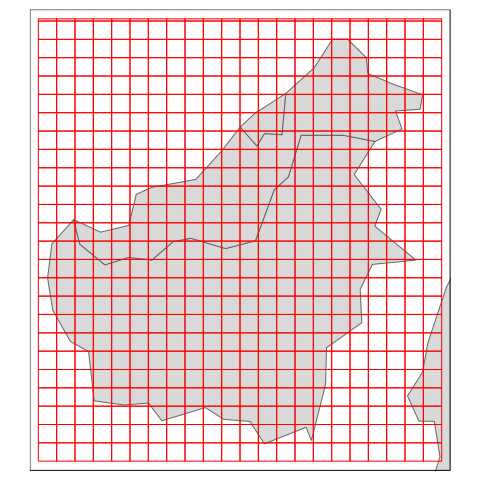
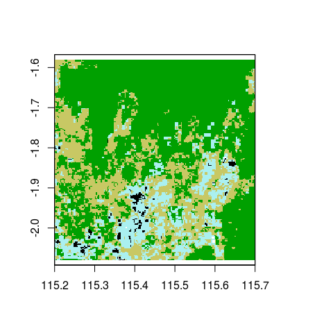
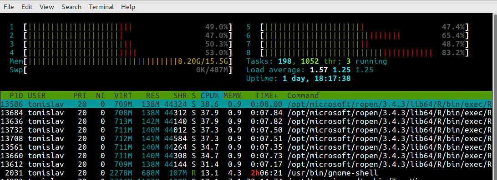
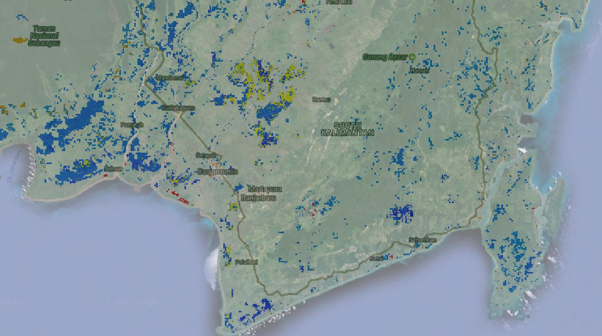
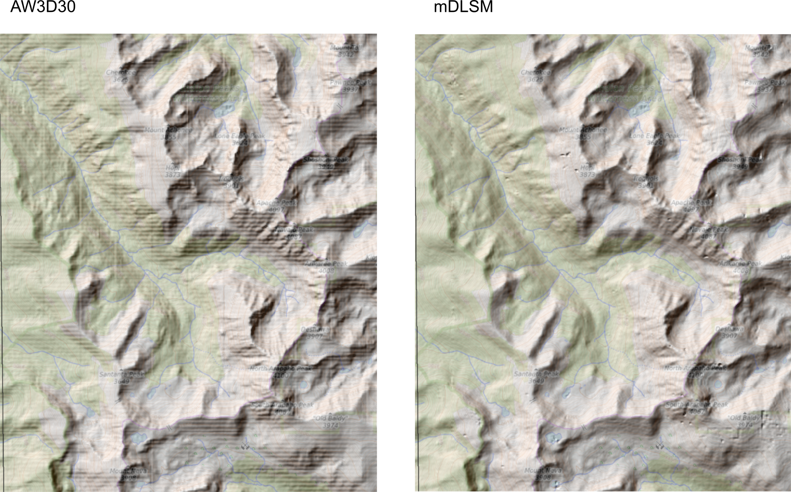

Processing Large Rasters using Tiling and Parallelization: An R + SAGA GIS + GRASS GIS (tutorial)
================
Hengl, T.

-   [Introduction](#introduction)
-   [Deriving differences in land cover using large GeoTIFFs](#deriving-differences-in-land-cover-using-large-geotiffs)
-   [DEM analysis using tiling and parallelization](#dem-analysis-using-tiling-and-parallelization)
-   [References](#references)

| <a href="https://github.com/thengl"></a> |
|-------------------------------------------------------------------------------------------------------------------------------------------------|

------------------------------------------------------------------------

<a href="https://creativecommons.org/licenses/by-sa/4.0/" target="_blank"></a>

Introduction
------------

Processing large spatial data in a programming environment such as R is not trivial. Even if you use powerful computing infrastructure, it might take careful programming to be able to process large spatial data. The reasons why R has not been recommended as a programming environment for large data were: (a) R does not handle well large objects in the working memory, and (b) for many existing functions parallelization is not implemented automatically but has to be added through additional programming. This tutorial demonstrates how to use R to read, process and create large spatial (raster) data sets. In principle, both examples follow the same systematic approach:

1.  prepare a function to run in parallel,
2.  tile object and estimate processing time,
3.  run function using all cores,
4.  build a virtual mosaic and final image using GDAL,
5.  avoid loading any large data in RAM,

In addition to R, we also provide some code examples of how to use SAGA GIS, GRASS GIS and GDAL in parallel. For more information, see also these [lecture notes](./tex/Processing_large_rasters_R.pdf). Packages used in this tutorial include:

``` r
list.of.packages <- c("plyr", "parallel", "GSIF", "ranger", "raster", 
                      "rgdal", "rgrass7", "snowfall", "lidR", "knitr", "tmap")
new.packages <- list.of.packages[!(list.of.packages %in% installed.packages()[,"Package"])]
if(length(new.packages)) install.packages(new.packages, dependencies = TRUE)
```

Note: the processing below is demonstrated using relatively large objects and a computer with 8 cores running on Ubuntu 16.04 operating system. To install software used in this tutorial and teach your-self some initial steps, consider reading [this document](https://envirometrix.github.io/PredictiveSoilMapping/soil-covs-chapter.html).

Deriving differences in land cover using large GeoTIFFs
-------------------------------------------------------

Land cover maps are often distributed as raster images showing distribution of 5–20 classes (Kirches et al., 2014). Here we use two images of ESA's land cover maps for Indonesia (Kalimantan island) obtained from the [ESA's land cover project website](https://www.esa-landcover-cci.org/?q=node/158) :

``` r
library(rgdal)
```

    ## Loading required package: sp

    ## rgdal: version: 1.3-3, (SVN revision 759)
    ##  Geospatial Data Abstraction Library extensions to R successfully loaded
    ##  Loaded GDAL runtime: GDAL 2.3.1, released 2018/06/22
    ##  Path to GDAL shared files: /usr/local/share/gdal
    ##  GDAL binary built with GEOS: TRUE 
    ##  Loaded PROJ.4 runtime: Rel. 4.9.2, 08 September 2015, [PJ_VERSION: 492]
    ##  Path to PROJ.4 shared files: (autodetected)
    ##  Linking to sp version: 1.2-5

``` r
library(raster)
GDALinfo("./data/Indonesia_ESA_lcc_300m_2000.tif")
```

    ## Warning: statistics not supported by this driver

    ## rows        5789 
    ## columns     5280 
    ## bands       1 
    ## lower left origin.x        108.7 
    ## lower left origin.y        -4.58 
    ## res.x       0.002083333 
    ## res.y       0.002083261 
    ## ysign       -1 
    ## oblique.x   0 
    ## oblique.y   0 
    ## driver      GTiff 
    ## projection  +proj=longlat +datum=WGS84 +no_defs 
    ## file        ./data/Indonesia_ESA_lcc_300m_2000.tif 
    ## apparent band summary:
    ##   GDType hasNoDataValue NoDataValue blockSize1 blockSize2
    ## 1   Byte           TRUE           0          1       5280
    ## apparent band statistics:
    ##   Bmin Bmax Bmean Bsd
    ## 1    0  255    NA  NA
    ## Metadata:
    ## AREA_OR_POINT=Area

this image is about 6000 by 6000 pixels in size hence not huge (for illustration, a land cover map of the whole world at 300 m resolution contains over billion pixels) but it could still be more efficiently processed if we use tiling and parallelization.

We are interested in deriving the difference in land cover between two periods 2000 and 2015. First, we make a function that can be used to detect differences:

``` r
make_LC_tiles <- function(i, tile.tbl, 
                          out.path="./tiled",
                          lc1="./data/Indonesia_ESA_lcc_300m_2000.tif",
                          lc2="./data/Indonesia_ESA_lcc_300m_2015.tif", 
                          leg.lcc){
  out.tif = paste0(out.path, "/T_", tile.tbl[i,"ID"], ".tif")
  if(!file.exists(out.tif)){
    m <- readGDAL(lc1, offset=unlist(tile.tbl[i,c("offset.y","offset.x")]),
                 region.dim=unlist(tile.tbl[i,c("region.dim.y","region.dim.x")]),
                 output.dim=unlist(tile.tbl[i,c("region.dim.y","region.dim.x")]),
                 silent = TRUE)
    m@data[,2] <- readGDAL(lc2, offset=unlist(tile.tbl[i,c("offset.y","offset.x")]),
                  region.dim=unlist(tile.tbl[i,c("region.dim.y","region.dim.x")]),
                  output.dim=unlist(tile.tbl[i,c("region.dim.y","region.dim.x")]), 
                  silent = TRUE)$band1
    names(m) <- c("LC2000","LC2015")
    m <- as(m, "SpatialPixelsDataFrame")
    ## Focus only on pixels that show land cover change
    sel <- !m$LC2000==m$LC2015
    if(sum(sel)>0){
      m <- m[sel,]
      m$v <- paste(m$LC2000, m$LC2015, sep="_")
      m$i <- plyr::join(data.frame(NAME=m$v), leg.lcc, type="left")$Value
      writeGDAL(m["i"], out.tif, type="Int16", 
                options="COMPRESS=DEFLATE", mvFlag=-32768)
    }
  }
}
```

this function we can run for each element `i` i.e. for smaller blocks and hence can be run in parallel. The function looks for where there has been a change in land cover, and then assign an unique number that identifies change from land cover class `A` to land cover class `B` (hence class `A-B`). We need to prepare a combined legend for combinations of land cover classes. This output legend we can prepare by using:

``` r
leg <- read.csv("./data/ESA_landcover_legend.csv")
str(leg)
```

    ## 'data.frame':    38 obs. of  8 variables:
    ##  $ Value      : int  0 10 11 12 20 30 40 50 60 61 ...
    ##  $ AGG_NAME   : Factor w/ 8 levels "Artificial areas",..: 5 3 3 3 3 3 6 4 4 4 ...
    ##  $ Value_AGG_w: int  0 3 3 3 3 3 2 1 1 1 ...
    ##  $ Value_AGG  : int  5 3 3 3 3 3 6 4 4 4 ...
    ##  $ NAME       : Factor w/ 38 levels "Bare areas","Consolidated bare areas",..: 14 4 8 35 3 10 12 25 23 22 ...
    ##  $ R          : int  0 255 255 255 170 220 200 0 0 0 ...
    ##  $ G          : int  0 255 255 255 240 240 200 100 160 160 ...
    ##  $ B          : int  0 100 100 0 240 100 100 0 0 0 ...

``` r
comb.leg <- expand.grid(leg$Value, leg$Value)
comb.leg$lcc <- paste(comb.leg$Var1, comb.leg$Var2, sep="_")
```

this gives almost 1400 combinations:

``` r
leg.lcc <- data.frame(Value=1:nrow(comb.leg), NAME=comb.leg$lcc)
head(leg.lcc)
```

    ##   Value NAME
    ## 1     1  0_0
    ## 2     2 10_0
    ## 3     3 11_0
    ## 4     4 12_0
    ## 5     5 20_0
    ## 6     6 30_0

Next, we prepare a tiling system to run processing in parallel:

``` r
library(raster)
library(GSIF)
```

    ## GSIF version 0.5-4 (2017-04-25)

    ## URL: http://gsif.r-forge.r-project.org/

``` r
## check whether the maps match perfectly to the same grid:
x <- raster::stack(paste0("./data/Indonesia_ESA_lcc_300m_", c(2000, 2015), ".tif"))
## OK!
obj <- GDALinfo("./data/Indonesia_ESA_lcc_300m_2000.tif")
```

    ## Warning in GDALinfo("./data/Indonesia_ESA_lcc_300m_2000.tif"): statistics
    ## not supported by this driver

``` r
## tile to 50km blocks:
tile.lst <- getSpatialTiles(obj, block.x=.5, return.SpatialPolygons=TRUE)
```

    ## Generating 550 tiles...

    ## Returning a list of tiles for an object of class GDALobj with 0 percent overlap

``` r
tile.tbl <- getSpatialTiles(obj, block.x=.5, return.SpatialPolygons=FALSE)
```

    ## Generating 550 tiles...
    ## Returning a list of tiles for an object of class GDALobj with 0 percent overlap

``` r
tile.tbl$ID <- as.character(1:nrow(tile.tbl))
head(tile.tbl)
```

    ##      xl    yl    xu    yu offset.y offset.x region.dim.y region.dim.x ID
    ## 1 108.7 -4.58 109.2 -4.08     5549        0          240          240  1
    ## 2 109.2 -4.58 109.7 -4.08     5549      240          240          240  2
    ## 3 109.7 -4.58 110.2 -4.08     5549      480          240          240  3
    ## 4 110.2 -4.58 110.7 -4.08     5549      720          240          240  4
    ## 5 110.7 -4.58 111.2 -4.08     5549      960          240          240  5
    ## 6 111.2 -4.58 111.7 -4.08     5549     1200          240          240  6

this gives a total of 550 tiles:

``` r
te <- as.vector(extent(x))
library(tmap)
data("World")
tm_shape(World, xlim=te[c(1,2)], ylim=te[c(3,4)], projection="longlat") +
  tm_polygons() +
  tm_shape(as(tile.lst, "SpatialLines")) + tm_lines()
```



Note that size of tiles needs to be carefully planned so that each tile can still be loaded in memory. If a HPC system has more cores, then in average size of tiles in memory needs to be smaller otherwise RAM might still be a problem for achieving fully parallelized computing.

We can visualize a single tile just to see that the images has been subset correctly:

``` r
## plot tile number 124:
i = 124
m <- readGDAL("./data/Indonesia_ESA_lcc_300m_2000.tif", 
              offset=unlist(tile.tbl[i,c("offset.y","offset.x")]),
              region.dim=unlist(tile.tbl[i,c("region.dim.y","region.dim.x")]),
              output.dim=unlist(tile.tbl[i,c("region.dim.y","region.dim.x")]))
```

    ## ./data/Indonesia_ESA_lcc_300m_2000.tif has GDAL driver GTiff 
    ## and has 5789 rows and 5280 columns

``` r
plot(raster(m), legend=FALSE, col=rgb(leg$R/255, leg$G/255, leg$B/255))
```



We can further use the snowfall package to compute all land cover changes and save them to disk:

``` r
library(snowfall)
```

    ## Loading required package: snow

``` r
sfInit(parallel=TRUE, cpus=parallel::detectCores())
```

    ## Warning in searchCommandline(parallel, cpus = cpus, type = type,
    ## socketHosts = socketHosts, : Unknown option on commandline:
    ## rmarkdown::render('/data/git/BigSpatialDataR/README.Rmd',~+~~+~encoding~+~

    ## R Version:  R version 3.4.3 (2017-11-30)

    ## snowfall 1.84-6.1 initialized (using snow 0.4-2): parallel execution on 8 CPUs.

``` r
sfExport("make_LC_tiles", "tile.tbl", "leg.lcc")
sfLibrary(rgdal)
```

    ## Library rgdal loaded.

    ## Library rgdal loaded in cluster.

``` r
sfLibrary(plyr)
```

    ## Library plyr loaded.

    ## Library plyr loaded in cluster.

``` r
out.lst <- sfClusterApplyLB(1:nrow(tile.tbl), 
                function(x){ make_LC_tiles(x, tile.tbl, leg.lcc=leg.lcc) })
sfStop()
```

    ## 
    ## Stopping cluster

``` r
## takes few seconds depending on the number of cores
```


<p class="caption">
Fully parallelized computing using 8 cores. Displayed using htop software.
</p>

This shows that the script has generated some 295 tiles in total. Note that if all land cover classes are unchanged, then there is no need to generate a Geotiff so that the total number of tiles is much smaller than what we get with `getSpatialTiles` function:

``` r
t.lst <- list.files("./tiled", pattern=".tif", full.names=TRUE)
str(t.lst)
```

    ##  chr [1:295] "./tiled/T_100.tif" "./tiled/T_101.tif" ...

From the list of files we can build a mosaic using GDAL and save it to disk (Mitchell & GDAL Developers, 2014):

``` r
out.tmp <- "./data/t_list.txt"
vrt.tmp <- "./data/indonesia.vrt"
cat(t.lst, sep="\n", file=out.tmp)
system(paste0('gdalbuildvrt -input_file_list ', out.tmp, ' ', vrt.tmp))
system(paste0('gdalwarp ', vrt.tmp, 
             ' \"./data/Indonesia_ESA_lcc_300m_change.tif\" ', 
             '-ot \"Int16\" -dstnodata \"-32767\" -co \"BIGTIFF=YES\" ',  
             '-multi -wm 2000 -co \"COMPRESS=DEFLATE\" -overwrite ',
             '-r \"near\" -wo \"NUM_THREADS=ALL_CPUS\"'))
```

``` r
raster("./data/Indonesia_ESA_lcc_300m_change.tif")
```

    ## class       : RasterLayer 
    ## dimensions  : 5760, 5280, 30412800  (nrow, ncol, ncell)
    ## resolution  : 0.002083294, 0.002083294  (x, y)
    ## extent      : 108.7, 119.6998, -4.580189, 7.419585  (xmin, xmax, ymin, ymax)
    ## coord. ref. : +proj=longlat +datum=WGS84 +no_defs +ellps=WGS84 +towgs84=0,0,0 
    ## data source : /data/git/BigSpatialDataR/data/Indonesia_ESA_lcc_300m_change.tif 
    ## names       : Indonesia_ESA_lcc_300m_change 
    ## values      : -32768, 32767  (min, max)


<p class="caption">
Land cover class changes (2000 to 2015) for Kalimantan.
</p>

Note that, to properly optimize computing, one might have to go through several iterations of improving the function and the tiling system. Also, when updating some results, it is a good idea to update only the tiles that need to be updated, which can again be specified in the function. Note also that from the code above, at any stage, we do not read the large images to R but only use R to program functions, run computing and build mosaics / large objects.

DEM analysis using tiling and parallelization
---------------------------------------------

In the next example we use multisource Digital Elevation Data to construct most accurate land surface model of an area, and then use R, GDAL, SAGA GIS and GRASS GIS to derive some DEM derivatives and classify landforms using the 30 m resolution land surface model (DLSM). The study area is 100 by 140 km area in the vicinity of Boulder CO. Two DEM data sources include:

-   1/3rd arc-second (10 m) National Elevation Dataset (NED) [produced by USGS](https://catalog.data.gov/dataset/national-elevation-dataset-ned-1-3-arc-second-downloadable-data-collection-national-geospatial);
-   1 arc-second (30 m) global ALOS AW3D30 Digital Surface Model [produced and distributed by the Japan Aerospace Exploration Agency](http://www.eorc.jaxa.jp/ALOS/en/aw3d30/index.htm);

Both elevation rasters can be considered to represent Land Surface Model i.e. height of the land surface or altitude. The NED data set is probably more accurate / more reliable, but the ALOS AW3D30 is available globally and is based primarily on remote sensing data. We would like to produce a merged product i.e. a product that is the best combination of the two. For this we can use the LiDAR based derived samples of land surface (as these are at the order of magnitude more detailed and more accurate) as referent points representing the whole study area.

We have downloaded some 1,400 LAS files from the opentopography.org website and converted the point clouds to 30 m resolution grids estimating the land surface altitude (based on the [lidR](https://github.com/Jean-Romain/lidR) package):

``` r
laz2grid <- function(file, res=30, out.dir, prj){
 out.file = paste0(out.dir, gsub(".laz", ".tif", basename(file)))
 if(!file.exists(out.file)){
   require(lidR); require(raster); require(sp)
   lidar = lidR::readLAS(file)
   dtm = lidR::grid_terrain(lidar, res=res, method = "knnidw")
   dtm.r = as.raster(dtm)
   raster::projection(dtm.r) <- paste(lidar@crs)
   dtm.s = raster::projectRaster(dtm.r, crs=prj, res=30)
   raster::writeRaster(dtm.s, filename=out.file, options="COMPRESS=DEFLATE", overwrite=TRUE)
 }
}
```

where the function `lidR::grid_terrain` generates land surface model by using only LiDAR points classified as ground.

In addition to the two elevation products, we can also add radar images of the area (ALOS PALSAR products) and NDVI images based on the Landsat cloud free images to account for the canopy and urban areas. To estimate the best combined Land Surface Model we will hence use the following formula:

    mDLSM = f (NED, AW3D30, NDVI, HH/HV)

where `NED` is the National Elevation Dataset, `AW3D30` is the ALOS digital surface model, `NDVI` is the Landsat based NDVI and `HH/HV` are the PALSAR-2 radar images at 20 m resolution (Shimada et al., 2014) bands HH (-27.7 5.3 dB) and HV (-35.8 3.0 dB). NDVI images can be used to represent the canopy height (the higher the NDVI the higher the chance that the canopy is high) and PALSAR-2 radar bands can be used to represent surface roughness, built up objects and bare rock areas.

We start by loading the training / reference points that have been derived from the [GLAS/ICESat mission](https://doi.org/10.5067/ICESAT/GLAS/DATA109) and the LiDAR based cloud data (downloaded from OpenTopography.org project and imported to R using the lidR package using the function from above):

``` r
pnt.ices <- read.csv("./data/icesat_1533635398523.csv")
pnt.ices <- pnt.ices[,1:3]
names(pnt.ices) <- c("x","y","mDLSM")
pnt.ices$type <- "ICESAT"
coordinates(pnt.ices) <- ~ x+y
proj4string(pnt.ices) <- "+proj=longlat +ellps=WGS84 +datum=WGS84 +no_defs"
pnt.lid <- sampleRandom(raster("./data/Boulder_LiDAR_30m.tif"), size=4e4, sp=TRUE)
names(pnt.lid) <- "mDLSM"
pnt.lid$type <- "LiDAR"
pnt.ices <- spTransform(pnt.ices, pnt.lid@proj4string)
pnt.all <- rbind(pnt.ices, pnt.lid)
## filter out values outside the range:
pnt.all <- pnt.all[pnt.all$mDLSM<5000&pnt.all$mDLSM>1000,]
## 48,649 points
```

Here the `icesat.csv` file has been obtained from the [openaltimetry.org](http://openaltimetry.org/data/icesat/) and the `Boulder_LiDAR_30m.tif` is a gridded file derived using LiDAR point clouds for a part of the study area.

Next we can overlay all points over the layers of interest and create a regression matrix. We can run this in parallel to speed up processing:

``` r
library(parallel)
```

    ## 
    ## Attaching package: 'parallel'

    ## The following objects are masked from 'package:snow':
    ## 
    ##     clusterApply, clusterApplyLB, clusterCall, clusterEvalQ,
    ##     clusterExport, clusterMap, clusterSplit, makeCluster,
    ##     parApply, parCapply, parLapply, parRapply, parSapply,
    ##     splitIndices, stopCluster

``` r
library(raster)
cov.lst = c("Boulder_AW3D30s_30m_v1802.tif", 
            "Boulder_NED_30m.tif", "Boulder_Landsat_red_30m_2014.tif",
            "Boulder_Landsat_NIR_30m_2014.tif",
            "Boulder_HH_30m.tif", "Boulder_HV_30m.tif")
xB <- raster::stack(paste0("./data/", cov.lst))
## all covariates can be stacked!
ov.cov <- parallel::mclapply(cov.lst, function(i){ 
                  raster::extract(raster(paste0("./data/", i)), pnt.all) }, 
                  mc.cores = detectCores())
ov.cov <- data.frame(ov.cov)
names(ov.cov) = cov.lst
```

This gives the following regression matrix:

``` r
rm.DLSM <- cbind(as.data.frame(pnt.all), ov.cov)
rm.DLSM$NDVI <- (rm.DLSM[,8] - rm.DLSM[,7]) / (rm.DLSM[,8] + rm.DLSM[,7]) * 100
str(rm.DLSM)
```

    ## 'data.frame':    48649 obs. of  11 variables:
    ##  $ mDLSM                           : num  1997 2141 2127 2190 2221 ...
    ##  $ type                            : chr  "ICESAT" "ICESAT" "ICESAT" "ICESAT" ...
    ##  $ x                               : num  -11720366 -11720308 -11720247 -11720190 -11720132 ...
    ##  $ y                               : num  4828943 4829394 4829843 4830294 4830744 ...
    ##  $ Boulder_AW3D30s_30m_v1802.tif   : num  2017 2155 2143 2207 2238 ...
    ##  $ Boulder_NED_30m.tif             : num  2011 2156 2143 2203 2237 ...
    ##  $ Boulder_Landsat_red_30m_2014.tif: num  46 35 34 35 38 42 32 51 29 38 ...
    ##  $ Boulder_Landsat_NIR_30m_2014.tif: num  58 49 55 51 61 61 50 57 54 51 ...
    ##  $ Boulder_HH_30m.tif              : num  2191 6101 2921 4712 2523 ...
    ##  $ Boulder_HV_30m.tif              : num  1187 2109 1611 2676 1355 ...
    ##  $ NDVI                            : num  11.5 16.7 23.6 18.6 23.2 ...

Next we can fit a Random Forest model that can be used to generate a combined estimate of the land surface elevation:

``` r
library(ranger)
fm.DLSM <- mDLSM ~ Boulder_AW3D30s_30m_v1802.tif + Boulder_NED_30m.tif +
  Boulder_HH_30m.tif + Boulder_HV_30m.tif + NDVI
sel.na <- complete.cases(rm.DLSM[,all.vars(fm.DLSM)])
summary(sel.na)
```

    ##    Mode   FALSE    TRUE 
    ## logical    2631   46018

``` r
m.DLSM <- ranger(fm.DLSM, rm.DLSM[sel.na,], num.trees=85, importance="impurity")
m.DLSM
```

    ## Ranger result
    ## 
    ## Call:
    ##  ranger(fm.DLSM, rm.DLSM[sel.na, ], num.trees = 85, importance = "impurity") 
    ## 
    ## Type:                             Regression 
    ## Number of trees:                  85 
    ## Sample size:                      46018 
    ## Number of independent variables:  5 
    ## Mtry:                             2 
    ## Target node size:                 5 
    ## Variable importance mode:         impurity 
    ## OOB prediction error (MSE):       944.9023 
    ## R squared (OOB):                  0.9970766

this is a highly accurate model with R-square above 0.99 (but with an RMSE of 30 m!) and where the most important bands are NED and AW3D30 elevation maps:

``` r
xl1.P <- as.list(ranger::importance(m.DLSM))
print(t(data.frame(xl1.P[order(unlist(xl1.P), decreasing=TRUE)])))
```

    ##                                     [,1]
    ## Boulder_NED_30m.tif           7794547483
    ## Boulder_AW3D30s_30m_v1802.tif 6290353304
    ## NDVI                           371621586
    ## Boulder_HV_30m.tif             211955744
    ## Boulder_HH_30m.tif             206007196

which was expected. Note that AW3D30s seems to come somewhat closer to the training points. To produce a combined mDLSM we run the fitted model at pixels of interest. To speed up the prediction we will first prepare a tiling system for this area:

``` r
objB <- GDALinfo("./data/Boulder_AW3D30s_30m_v1802.tif")
```

    ## Warning in GDALinfo("./data/Boulder_AW3D30s_30m_v1802.tif"): statistics not
    ## supported by this driver

``` r
library(GSIF)
## tile to 10km blocks:
tileB.lst <- getSpatialTiles(objB, block.x=1e4, return.SpatialPolygons=TRUE)
```

    ## Generating 100 tiles...

    ## Returning a list of tiles for an object of class GDALobj with 0 percent overlap

``` r
tileB.tbl <- getSpatialTiles(objB, block.x=1e4, return.SpatialPolygons=FALSE)
```

    ## Generating 100 tiles...
    ## Returning a list of tiles for an object of class GDALobj with 0 percent overlap

``` r
tileB.tbl$ID <- as.character(1:nrow(tileB.tbl))
```

next we prepare a function that we can use to create tiled objects and that we can then use to predict values in parallel:

``` r
predict_mDLSM <- function(m.DLSM, i, tileB.tbl, cov.lst, in.path="./data/", out.path="./tiledB/"){
  out.tif = paste0(out.path, "T_", tileB.tbl[i,"ID"], ".tif")
  if(!file.exists(out.tif)){
    covs.files <- paste0(in.path, cov.lst)
    newdata <- readGDAL(covs.files[1], offset=unlist(tileB.tbl[i,c("offset.y","offset.x")]),
                 region.dim=unlist(tileB.tbl[i,c("region.dim.y","region.dim.x")]),
                 output.dim=unlist(tileB.tbl[i,c("region.dim.y","region.dim.x")]),
                 silent = TRUE)
    for(j in 2:length(cov.lst)){
      newdata@data[,j] <- readGDAL(covs.files[j],
                 offset=unlist(tileB.tbl[i,c("offset.y","offset.x")]),
                 region.dim=unlist(tileB.tbl[i,c("region.dim.y","region.dim.x")]),
                 output.dim=unlist(tileB.tbl[i,c("region.dim.y","region.dim.x")]),
                 silent = TRUE)$band1
    }
    names(newdata) <- basename(covs.files)
    newdata$NDVI <- (newdata@data[,4] - newdata@data[,3]) / 
        (newdata@data[,4] + newdata@data[,3]) * 100
    newdata$NDVI <- ifelse(is.na(newdata$NDVI), 0, newdata$NDVI)
    sel.pr <- complete.cases(newdata@data)
    out <- predict(m.DLSM, newdata@data[sel.pr,])
    g <- as(newdata[1], "SpatialPixelsDataFrame")
    g[sel.pr,"m"] = out$predictions
    writeGDAL(g["m"], out.tif, type="Int16", 
                options="COMPRESS=DEFLATE", mvFlag=-32768)
  }
}
```

Now we can predict the values of mDLSM at locations by using:

``` r
library(snowfall)
sfInit(parallel=TRUE, cpus=parallel::detectCores())
```

    ## Warning in searchCommandline(parallel, cpus = cpus, type = type,
    ## socketHosts = socketHosts, : Unknown option on commandline:
    ## rmarkdown::render('/data/git/BigSpatialDataR/README.Rmd',~+~~+~encoding~+~

    ## snowfall 1.84-6.1 initialized (using snow 0.4-2): parallel execution on 8 CPUs.

``` r
sfExport("predict_mDLSM", "m.DLSM", "tileB.tbl", "cov.lst")
sfLibrary(rgdal)
```

    ## Library rgdal loaded.

    ## Library rgdal loaded in cluster.

``` r
sfLibrary(ranger)
```

    ## Library ranger loaded.

    ## Library ranger loaded in cluster.

``` r
outB.lst <- sfClusterApplyLB(1:nrow(tileB.tbl), 
                function(x){ predict_mDLSM(m.DLSM, x, tileB.tbl, cov.lst) })
sfStop()
```

    ## 
    ## Stopping cluster

``` r
## takes few minutes
```

This produces a merged digital land surface model that can be further used for spatial modeling:

``` r
tB.lst <- list.files("./tiledB", pattern=".tif", full.names=TRUE)
outB.tmp <- "./data/b_list.txt"
vrtB.tmp <- "./data/boulder.vrt"
cat(tB.lst, sep="\n", file=outB.tmp)
system(paste0('gdalbuildvrt -input_file_list ', outB.tmp, ' ', vrtB.tmp))
system(paste0('gdalwarp ', vrtB.tmp, 
             ' \"./data/Boulder_mDLSM_30m.tif\" ', 
             '-ot \"Int16\" -dstnodata \"-32767\" -co \"BIGTIFF=YES\" ',  
             '-multi -wm 2000 -co \"COMPRESS=DEFLATE\" -overwrite ',
             '-r \"near\" -wo \"NUM_THREADS=ALL_CPUS\"'))
```


<p class="caption">
Comparison of the original AW3D30 vs the predicted Land Surface Model (mDLSM). Fitting a model to predict land surface model seems to solve the problem of artifacts / striping effects, but then it can introduce local artifacts in areas of higher vegetation and under-represented by training points.
</p>

The resulting product seems to be satisfactory except in the eastern side of the study areas (plains) where RF seems to create many artificial spikes. RF is known to be very sensitive to extrapolation, so in this case it seems that plain areas were systematically under-represented and require additional training points. Note also that ranger package provides an option to derive also uncertainty of the predicted elevations in terms of lower and upper quantiles (read more in Hengl, Nussbaum, Wright, Heuvelink, & Gräler (2018)) so we could theoretically run Monte Carlo simulations or similar.

We can next use the newly produced mDLSM to derive number of DEM derivatives. SAGA GIS (Conrad et al., 2015) allows us to run processing in parallel, hence there is no need to tile. For example, to derive a slope map we can use:

``` r
tmp = tempfile(fileext = ".sdat")
system(paste0('gdal_translate ./data/Boulder_mDLSM_30m.tif -of \"SAGA\" ', tmp))
#system(paste0('saga_cmd ta_hydrology 15 -DEM=\"', 
#               gsub(".sdat", ".sgrd", tmp), '\" -TWI=\"', 
#               gsub(".sdat", "_twi.sgrd", tmp), '\"') ) 
system(paste0('saga_cmd ta_morphometry 0 -ELEVATION=\"', 
                        gsub(".sdat", ".sgrd", tmp), '\" -SLOPE=\"', 
                        gsub(".sdat", "_slope.sgrd", tmp), 
                        '\" -C_PROF=\"', 
                        gsub(".sdat", "_cprof.sgrd", tmp), '\"') )
system(paste0('gdal_translate ', gsub(".sdat", "_slope.sdat", tmp), 
              ' ./data/Boulder_mDLSM_slope_30m.tif -scale ',  
              ' -ot "Byte" -co \"COMPRESS=DEFLATE\"'))
```

SAGA automatically recognizes number of cores available and is thus highly suitable for processing large rasters on massive infrastructure.

To derive landform classes using the classification system of Jasiewicz & Stepinski (2013), we can also test using GRASS GIS, which is possible directly from R thanks to the spgrass7 package:

``` r
library(rgrass7)
rname <- "./data/Boulder_mDLSM_30m.tif"
# Set GRASS environment and database location 
loc <- initGRASS("/usr/lib/grass74", home="/data/tmp/", 
                 gisDbase="GRASS_TEMP", override=TRUE)
execGRASS("r.in.gdal", flags="o", parameters=list(input=rname, output="mDLSM"))
execGRASS("g.region", parameters=list(raster="mDLSM"))
execGRASS("r.geomorphon", parameters=list(elevation="mDLSM", forms="mDLSMg"))
#plot(readRAST("mDLSMg"))
execGRASS("r.out.gdal", parameters=list(input="mDLSMg",
          output="./data/Boulder_mDLSMg_30m.tif", 
          type="Byte", createopt="COMPRESS=DEFLATE"))
## clean-up
unlink("./GRASS_TEMP", recursive = TRUE)
unset.GIS_LOCK()
unlink_.gislock()
remove_GISRC()
```

GRASS 7 is also fairly efficient with processing large rasters (Neteler, 2015), even though parallelization needs to be implemented also with tiling. In fact, GRASS GIS can be regarded as an environment that provides applications (commands/modules), which means that, by extending the code described above one should be able to run several GRASS commands in parallel.

References
----------

Conrad, O., Bechtel, B., Bock, M., Dietrich, H., Fischer, E., Gerlitz, L., … Böhner, J. (2015). System for automated geoscientific analyses (saga) v. 2.1.4. *Geoscientific Model Development*, *8*(7), 1991–2007. doi:[10.5194/gmd-8-1991-2015](https://doi.org/10.5194/gmd-8-1991-2015)

Hengl, T., Nussbaum, M., Wright, M. N., Heuvelink, G. B., & Gräler, B. (2018). Random forest as a generic framework for predictive modeling of spatial and spatio-temporal variables. *PeerJ Preprints*, *6*, e26693v3. doi:[10.7287/peerj.preprints.26693v3](https://doi.org/10.7287/peerj.preprints.26693v3)

Jasiewicz, J., & Stepinski, T. F. (2013). Geomorphons — a pattern recognition approach to classification and mapping of landforms. *Geomorphology*, *182*, 147–156. doi:[https://doi.org/10.1016/j.geomorph.2012.11.005](https://doi.org/https://doi.org/10.1016/j.geomorph.2012.11.005)

Kirches, G., Brockmann, C., Boettcher, M., Peters, M., Bontemps, S., Lamarche, C., … Defourny, P. (2014). *Land Cover CCI Product User Guide: Version 2* (p. 4). ESA.

Mitchell, T., & GDAL Developers. (2014). *Geospatial Power Tools: GDAL Raster & Vector Commands*. Locate Press.

Neteler, M. (2015). GRASS GIS 7: efficiently processing big geospatial data. In *FOSDEM 2015* (p. 1).

Shimada, M., Itoh, T., Motooka, T., Watanabe, M., Shiraishi, T., Thapa, R., & Lucas, R. (2014). New global forest/non-forest maps from alos palsar data (2007–2010). *Remote Sensing of Environment*, *155*, 13–31.
